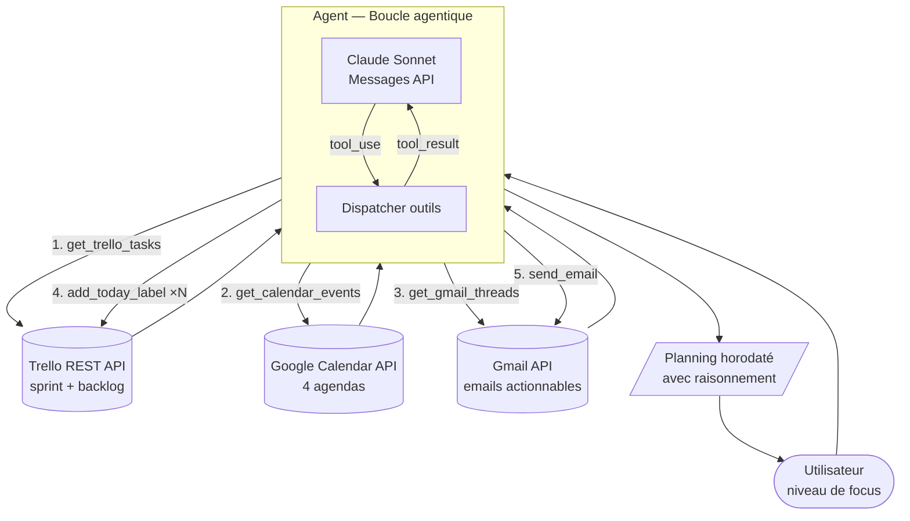

# Agent Planning Matinal 🗓️

> Un agent IA autonome qui lit mes outils du matin (Trello, Google Calendar, Gmail) et produit un plan de journée horodaté, priorisé et directement actionnable — sans que j'aie à réfléchir à la priorisation.


---

## Problème

Chaque matin, les mêmes frictions :

- Les tâches du sprint Trello ne tiennent pas compte de l'agenda du jour
- L'agenda ne connaît pas les priorités des tâches
- Les emails de la nuit peuvent créer des urgences invisibles
- La décision "par quoi je commence ?" prend 15 à 30 minutes d'énergie cognitive

Ce projet automatise entièrement cette décision.

---

## Ce que fait l'agent

Au lancement, l'agent demande le niveau de focus du jour (faible / moyen / bon / élevé), puis :

1. Lit les cartes du sprint courant et du backlog Trello
2. Lit les événements du jour sur tous les agendas Google Calendar
3. Lit les emails récents susceptibles de générer des actions
4. Raisonne, priorise, et produit un planning horodaté avec justification pour chaque choix
5. Applique automatiquement le label **TODAY** sur les cartes Trello sélectionnées
6. Envoie le planning complet par email

Durée d'exécution : ~30 secondes.

---

## Architecture



### Boucle agentique

L'agent utilise l'[API Messages d'Anthropic](https://docs.anthropic.com/en/api/messages) en boucle manuelle — sans framework. À chaque itération :

```
Claude décide → demande un outil → outil exécuté localement → résultat renvoyé → Claude décide...
```

La boucle s'arrête quand Claude produit une réponse finale (`stop_reason: end_turn`).

---

## Logique de priorisation

L'agent applique des règles métier explicites encodées dans le prompt système :

| Dimension | Règle |
|-----------|-------|
| **Priorité** | P0 toujours en premier, le matin, en Deep Work |
| **Focus × Type** | Focus faible → Shallow/Admin uniquement. Focus élevé → Deep Work en premier |
| **Charge cognitive** | High CL le matin. Low CL en fin de journée |
| **Taille** | XS groupés en Quick Wins. L découpé en blocs 45-90 min |
| **Agenda** | Impératifs (sport, pro) = intouchables. Mathilde en pharmacie = créneau Deep Work |

Si les métadonnées `[P|T|CL|S]` sont absentes d'une carte Trello, l'agent les infère depuis le titre et la description, en indiquant l'inférence dans son raisonnement.

---

## Démo

### Exécution en terminal

```
============================================================
  AGENT PLANNING MATINAL
============================================================

Niveau de focus aujourd'hui ?
  1 — Faible   2 — Moyen   3 — Bon   4 — Élevé
→ 4

[agent] Démarrage — focus élevé

[tool] get_trello_tasks({"include_backlog": true})
       → {"sprint": "SPRINT 7 - 24→31.05", "cards": [...], ...}

[tool] get_calendar_events({"include_all_day": true})
       → {"events": [...], "error": null}

[tool] get_gmail_threads({"days_back": 2, "max_results": 15})
       → {"threads": [...], "error": null}

[tool] add_today_label({"card_id": "..."})
       → {"success": true, ...}

[tool] send_email({"to": "...", "subject": "[Planning] Lundi 25 mai — Focus élevé", ...})
       → {"success": true, "message_id": "..."}
```

### Extrait du planning produit

```
🗓 PLANNING DU LUNDI 25 MAI 2026 — Focus ÉLEVÉ

09:00 – 10:30 🔴 [AGENT] Intégration WhatsApp MCP (Deep Work · L · High CL)
→ P0, High CL : fenêtre de focus maximal du matin. Tâche L découpée en 90 min.
  Ne pas interrompre.

10:30 – 11:00 ⚡ QUICK WINS
  • RIB BDT (~10 min)
  • Répondre à Alexis Soler (~10 min)
→ Low CL, XS groupés. Transition naturelle après le Deep Work.

[...]

📋 REPORTÉ À DEMAIN
• Trail Veitavere — Énergie insuffisante après journée chargée
```

---

## Stack technique

| Composant | Technologie |
|-----------|-------------|
| Modèle | Claude Sonnet (Anthropic Messages API) |
| Boucle agentique | Python — boucle `while` manuelle, sans framework |
| Gestion des tâches | Trello REST API |
| Agenda | Google Calendar API v3 — OAuth 2.0 Desktop |
| Email | Gmail API — OAuth 2.0, lecture + envoi |
| HTTP | `httpx` (évite les problèmes `httplib2` sur Windows) |
| Auth Google | `google-auth-oauthlib` — token persistant |

Aucun framework agentique (pas de LangChain, pas d'AutoGen). La boucle `tool_use` est implémentée à la main pour comprendre et contrôler chaque décision du modèle.

---

## Installation

```bash
git clone https://github.com/QuentinBaron/claude-ai-portfolio
cd 03-agent-planning
pip install anthropic httpx google-auth google-auth-oauthlib tzdata
```

Variables d'environnement requises :

```bash
ANTHROPIC_API_KEY=...
TRELLO_API_KEY=...
TRELLO_TOKEN=...
TRELLO_BOARD_ID=...
GOOGLE_CREDENTIALS_FILE=.../google_credentials.json
```

Première exécution Google : le navigateur s'ouvre pour l'auth OAuth. Le token est ensuite persisté automatiquement.

```bash
python main.py
```

---

## Ce que ce projet démontre

**Architecture agentique** — Implémentation from scratch de la boucle `tool_use` de l'API Anthropic : gestion des blocs `tool_use` / `tool_result`, historique des messages, conditions d'arrêt.

**Intégration systèmes hétérogènes** — Trois APIs avec des protocoles d'auth différents (API key, OAuth 2.0 Desktop) et des formats de données hétérogènes, unifiés dans une interface cohérente pour le modèle.

**Conception de règles métier** — Le prompt système encode une logique de priorisation réelle (P × Type × CL × Size × focus × contraintes agenda). L'agent justifie chaque décision, ce qui le rend auditables et ajustable.

**Autonomie et effets réels** — L'agent ne produit pas seulement du texte : il modifie l'état externe (labels Trello) et envoie un email. C'est un agent à effets, pas un chatbot.

**Conception produit** — Le projet part d'un problème réel, définit des critères de succès mesurables (planning réaliste et actionnable en < 30 sec), et est conçu pour être utilisé quotidiennement.

---

## Roadmap

- [x] Lecture Trello (sprint courant + backlog, métadonnées parsées)
- [x] Lecture Google Calendar (4 agendas, logique différenciée)
- [x] Lecture Gmail (emails actionnables)
- [x] Label TODAY appliqué automatiquement sur Trello
- [x] Email de digest avec raisonnement complet
- [ ] Intégration WhatsApp (envoi planning sur téléphone)
- [ ] Mode ajustement mid-day (conversation post-planning)
- [ ] Auto-démarrage au boot (Planificateur de tâches Windows)

---

## Contexte

Projet développé dans le cadre d'un apprentissage autonome de l'ingénierie agentique avec l'API Anthropic. Fait partie d'un portfolio de projets IA appliqués à des besoins réels.

Profil GitHub : [github.com/QuentinBaron](https://github.com/QuentinBaron)
