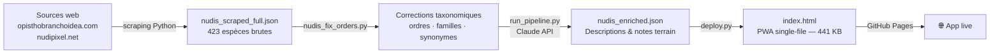

# 🐚 Nudidex — Identificateur de nudibranches de Polynésie française


**🌐 Application live → [quentinbaron.github.io/claude-ai-portfolio/05-application/Nudidex](https://quentinbaron.github.io/claude-ai-portfolio/05-application/Nudidex/)**

---

## Approche

Aucun outil numérique n'existait pour identifier les nudibranches de Polynésie française sur le terrain. Nudidex est une **PWA installable** couvrant 423 espèces, conçue et développée en développement IA-assisté avec Claude — du pipeline de données à l'interface mobile-first, en passant par l'identificateur interactif.

---

## Contexte & Problème

Les nudibranches (mollusques marins opisthobranches) comptent des centaines d'espèces en Polynésie française. Les ressources existantes sont soit trop généralistes (faunes mondiales), soit indisponibles hors connexion — problématique pour une utilisation directement au bord de l'eau ou en sortie de plongée.

**Le besoin** : un outil local, rapide, fonctionnel sans réseau, couvrant les espèces polynésiennes avec des critères d'identification visuels adaptés au terrain.

---

## Architecture



Le pipeline est **entièrement reproductible** : un `python deploy.py` reconstruit et déploie l'application depuis les sources brutes.

---

## Fonctionnalités

### Identificateur interactif
Système de questions binaires progressives par famille (`FOLLOWUP_QUESTIONS`) : chaque question réduit le pool de candidats en ciblant un critère morphologique discriminant (forme de la queue, présence de cérates, voiles natatoires, tentacules oraux…). L'ordre des questions est calculé dynamiquement selon le pool courant.

### Navigation taxonomique hiérarchique
Filtres en cascade **Ordre → Famille** : sélectionner un ordre restreint la liste des familles disponibles. Zéro rechargement, tout en JavaScript vanilla.

### Vues multiples
- **Tableau** : trié par colonne (nom, famille, ordre), avec notes terrain et indice d'observation
- **Cartes photos** : grille responsive avec groupement par famille ou par ordre

### Recherche
Recherche temps réel sur nom scientifique, nom commun et famille.

### PWA offline-first
Installable sur Android/iOS directement depuis le navigateur. Fonctionne sans réseau une fois installée — conçu pour un usage en sortie de plongée.

---

## Stack technique

| Composant | Technologie |
|-----------|------------|
| Front-end | HTML5 · CSS3 · JavaScript ES6 (vanilla, zéro dépendance) |
| Pipeline données | Python 3 — scraping, nettoyage, enrichissement |
| IA | Claude API (Anthropic) — génération de descriptions enrichies |
| Déploiement | GitHub Pages — CI manuel via `deploy.py` |
| Format de distribution | Single-file HTML — 1 fichier, 441 KB, zéro build step |

---

## Processus de développement IA-assisté

Ce projet illustre une approche de **développement en collaboration avec l'IA** :

- **Conception** : architecture générale, choix du format single-file, logique de l'identificateur — conçus en dialogue avec Claude
- **Implémentation** : fonctionnalités itérées session par session (filtres hiérarchiques, système de questions progressives, pipeline de déploiement)
- **Débogage** : récupération de fichiers JSON corrompus (423 espèces reconstituées depuis le HTML déployé), correction de bugs logiques dans le système de questions
- **Taxonomie** : corrections d'ordres et de familles sur la base de littérature spécialisée, intégrées dans le pipeline

Chaque session a produit un incrément fonctionnel déployé. La base de code est maintenue par un seul développeur avec l'IA comme partenaire de conception et de revue.

---

## Ce que ça démontre

| Compétence | Manifestation concrète |
|------------|----------------------|
| **Conception produit** | Du besoin terrain à la livraison — définition des specs, UX, pipeline, déploiement |
| **Développement IA-assisté** | Architecture conçue et itérée avec Claude ; débogage collaboratif sur données réelles |
| **Pipeline de données** | Scraping → nettoyage taxonomique → enrichissement IA → intégration dans la PWA |
| **Front-end mobile-first** | Interface optimisée pour usage terrain (petit écran, lumière vive, mains mouillées) |
| **Livraison continue** | 423 espèces, pipeline reproductible, déploiement GitHub Pages en une commande |

---

## Structure du repo

```
05-application/Nudidex/
├── index.html               # PWA complète (généré par deploy.py)
├── manifest.json            # Manifeste PWA
├── nudis_template_v2.html   # Template source avec logique JS/CSS
├── nudis_scraped_full.json  # Données brutes — 423 espèces
├── nudis_enriched.json      # Données enrichies (pipeline output)
├── deploy.py                # Script de déploiement principal
├── run_pipeline.py          # Enrichissement via Claude API
└── nudis_fix_orders.py      # Corrections taxonomiques
```

---

## Installation & Utilisation locale

```bash
# Cloner le repo
git clone https://github.com/quentinbaron/claude-ai-portfolio.git
cd claude-ai-portfolio/05-application/Nudidex

# Installer les dépendances Python
pip install -r requirements.txt

# Déployer (reconstruit index.html depuis les sources)
python deploy.py
```

Pour utiliser l'app sans modification : ouvrir directement `index.html` dans un navigateur ou accéder à la [version live](https://quentinbaron.github.io/claude-ai-portfolio/05-application/Nudidex/).

---

## Roadmap

- [ ] Clé dichotomique textuelle (identification pas-à-pas sans photos)
- [ ] Jeu de reconnaissance progressive
- [ ] Formulaire d'observation terrain (ajout d'espèces)
- [ ] Filtres par profondeur et substrat
- [ ] Complétion taxonomique (familles Sacoglossa)

---

*Projet personnel — Quentin Baron · Ingénieur · Polynésie française · 2025-2026*
